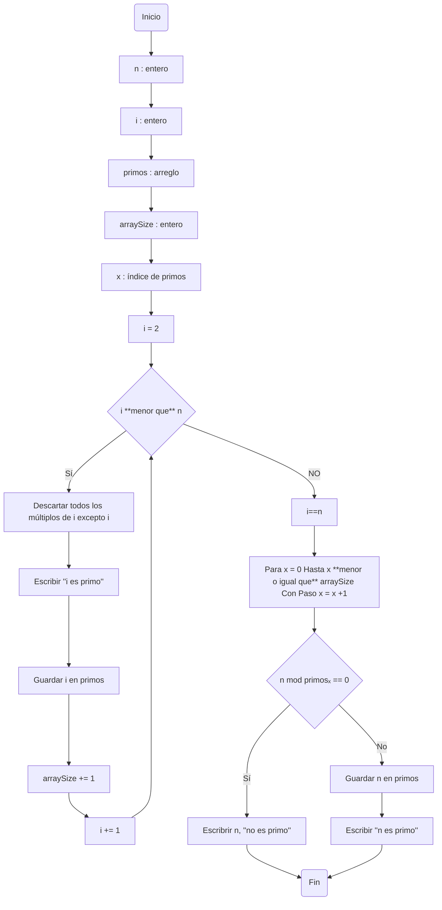
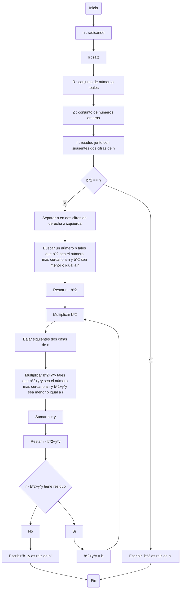
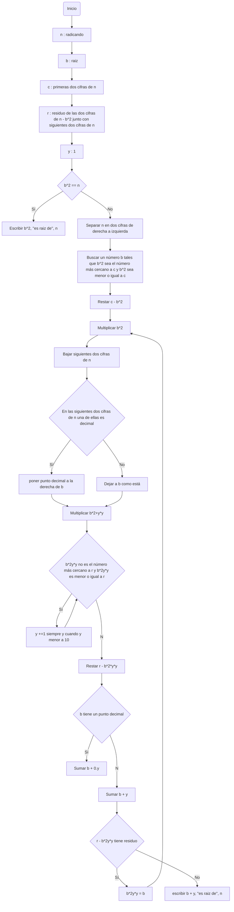

# Reto-no.3
_El siguiente repositorio muestra el pseudo código y diagrama de flujo del algoritmo para para hallar los números primos hasta un número natural n y del algoritmo para obtener raíces cuadradas_
## Tabla de contenido
1. [Algoritmo para hallar los números primos hasta un número natural n](#algoritmo-para-hallar-los-números-primos-hasta-un-número-natural-n)
	- [Pseudocódigo 1](#pseudocódigo-1)
	- [Diagrama de flujo 1](#diagrama-de-flujo-1)
2. [Algoritmo para sacar raiz cuadrada a un número n](#algoritmo-para-sacar-raiz-cuadrada-a-un-número-n)
	- [Pseudocódigo 2](#pseudocódigo-2)
	- [Diagrama de flujo 2](#diagrama-de-flujo-2)

### Algoritmo para hallar los números primos hasta un número natural n
#### Pseudocódigo 1
```pseudocode
n : entero
i : entero
primos : arreglo
arraySize : entero

Inicio
  i := 2
  Mientras (i < n) hacer
     descartar todos los múltiplos de i excepto i
     escribir ("i es primo")
     Guardar i en primos
     arraySize += 1
     i := i + 1
  Fin mientras
    Si i==n entonces 
      para x = 0 hasta x <= arraySize Con Paso x = x +1
        Si (n mod primosₓ == 0) Entonces:
          escribrir ("n no es primo")
        Fin si
      Fin para
      Guardar n en primos
    Fin si
Fin
```
#### Diagrama de flujo 1

### Algoritmo para sacar raiz cuadrada a un número n
#### Pseudocódigo 2
```pseudocode
n : radicando
b : raiz
c : primeras dos cifras de n
r : residuo de las dos cifras de n - b^2 junto con siguientes dos cifras de n
y : 1

Inicio
  Si b^2 == n Entonces
  	escribir (b^2, ''es raiz de'', n)
  Sino
  	separar n en dos cifras de derecha a izquierda
  	buscar un número b tales que b^2 sea el número más cercano a c ∧ b^2 ≤ c
  	restar c - b^2
  	multiplicar b*2
  	bajar siguientes dos cifras de n
		Si en las siguientes dos cifras de n una de ellas es decimal Entonces
			poner punto decimal a la derecha de b
		Sino
			dejar a b como está
  	Multiplicar (b*2)y*y
	Mientras (b*2)y*y no sea el número más cercano a r ∧ (b*2)y*y ≤ r Entonces
		y +=1 siempre y cuando y < 10
	Fin Mientras
	Si (b*2)y*y es el número más cercano a r ∧ (b*2)y*y ≤ r Entonces
		restar r - (b*2)y*y
	Fin Si
	Si b tiene un punto decimal Entonces
		sumar b + 0.y
	Sino
		sumar b + y
	Mientras r - (b*2)y*y tenga residuo Hacer
		(b*2)y*y = b
		repetir desde (Multiplicar b*2)
	Fin mientras
	Si r - (b*2)y*y no tiene residuo Entonces
            escribir(b + y, ''es raiz de'' n)
	Fin si
  Fin si           
```
#### Diagrama de flujo 2



