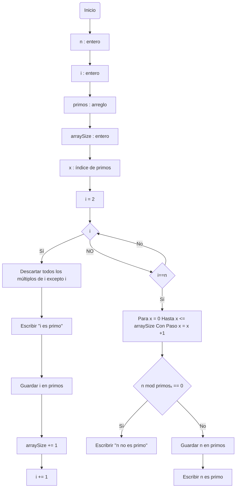

# Reto-no.3
_El siguiente repositorio muestra el pseudo código y diagrama de flujo del algoritmo para para hallar los números primos hasta un número natural n y del algoritmo para obtener raíces cuadradas_

## Algoritmo para hallar los números primos hasta un número natural n
### Pseudocódigo
```pseudocode
n : entero
i : entero
primos : arreglo
arraySize : entero

Inicio
  i := 2
  Mientras (i < n) hacer
     descartar todos los múltiplos de i excepto i
	 escribir ("i es primo")
	 Guardar i en primos
	 arraySize += 1
      i := i + 1
	Fin mientras
	Si i==n entonces 
	    para x = 0 hasta x <= arraySize Con Paso x = x +1
			Si (n mod primosₓ == 0) Entonces:
			 	escribrir ("n no es primo")
			Fin si
		Fin para
	    Guardar n en primos
	Fin si
Fin
```
### Diagrama de flujo

