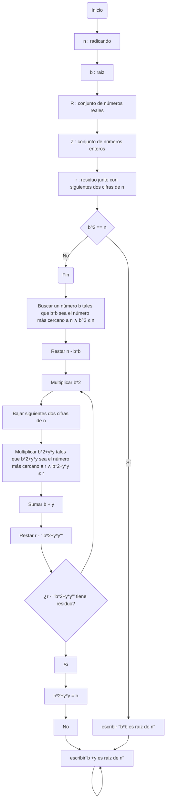

# Reto-no.3
_El siguiente repositorio muestra el pseudo código y diagrama de flujo del algoritmo para para hallar los números primos hasta un número natural n y del algoritmo para obtener raíces cuadradas_

## Algoritmo para hallar los números primos hasta un número natural n
### Pseudocódigo
```pseudocode
n : entero
i : entero
primos : arreglo
arraySize : entero

Inicio
  i := 2
  Mientras (i < n) hacer
     descartar todos los múltiplos de i excepto i
     escribir ("i es primo")
     Guardar i en primos
     arraySize += 1
     i := i + 1
  Fin mientras
    Si i==n entonces 
      para x = 0 hasta x <= arraySize Con Paso x = x +1
        Si (n mod primosₓ == 0) Entonces:
          escribrir ("n no es primo")
        Fin si
      Fin para
      Guardar n en primos
    Fin si
Fin
```
### Diagrama de flujo

## Algoritmo para sacar raiz cuadrada a un número n
### Pseudocódigo
```pseudocode
n : radicando
b : raiz
ℝ : conjunto de números reales
Z : conjunto de números enteros
r : residuo junto con siguientes dos cifras de n

Inicio
  Si b^2 == n Entonces
  	escribir (''b^2 es raiz de n'')
  Sino
  	Separar n en dos cifras de derecha a izquierda
  	Buscar un número b tales que b^2 sea el número más cercano a n ∧ b^2 ≤ n
  	Restar n - b^2
  	Multiplicar b*2
  	Bajar siguientes dos cifras de n
  	Multiplicar (b*2)y*y tales que (b*2)y*y sea el número más cercano a r ∧ (b*2)y*y ≤ r
  	Restar r - (b*2)y*y
	Sumar b + y
          Si r - (b*2)y*y tiene residuo Entonces
            (b*2)y*y = b*2
          Sino b + y es Entonces
            escribir(''b +y es raiz de n)
          Fin si
  Fin si           
```
### Diagrama de flujo
[](https://mermaid.live/edit#pako:eNqFU81uGjEQfpXRXkggXHIkolUJgZAE8rOcaqjkXQ-JI9YmXlsVQdzTx6hUqae-QC-VypvkSTpe7ChJlXYv-63nm2_mmx2vklwLTFrJbK4_5zfcWBh3DyYK6PmwM1Ayl3oXms130GEKWmC4kDlXQk8DqUOxw4APWVZR5P20SukyuKKDXKtbp6wGgaA2Pws0ugSDfI5lVOkS_SjgI_bxrSRU1r-nXrzHjC-GpRROw5ZLSVDKayc9sQRBKbmcGV5WKrFYr2quH776q-zTPrTboNbNJqSbH1X0mGGZG5lJA7VaVs-A5LyxSqhWi1J9ShnpKmPAUlxwww0o6vNVbYEGabrAQd7fUXtG8CgxoOSTgE9Yx5U5STgVTUMG1k8K7hyCb6REDjh_Chebr1QIDf0UTfIKHh--g3f0-OUbWfadnbIrLG3VWNNLxMqnFDwL-IwN3dzKxVz68ll9v8ocsg6_pe__z3RI9FHAo9dajWV9-cLF9uTfTszWSeB6N8b3dM5SV3hZaMAyVj-nwEXAF9GtIbc1__MqBUI-_XL1-9dfAbBkDuMuvV9763ERUhZbaMPT5C6fTS71rLAD4xdbA43lG2szJvI44ONneLDTk2r3INlLaCIFl4Iu5sqHJom9wQInSYugwBmnAU-SiVoTlTur06XKk5Y1DvcStxDcYlfya8OLeIhCWm2G27teXfn1H5BFQAI)


